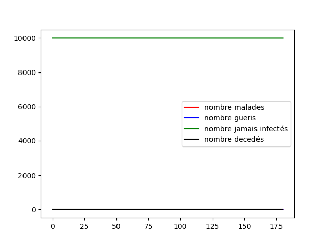
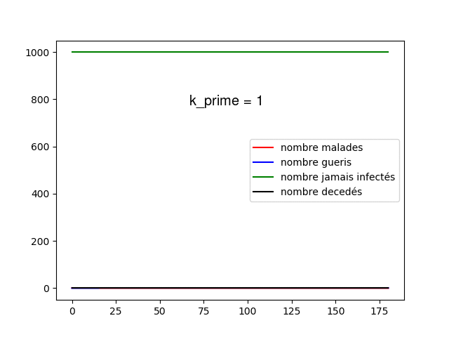
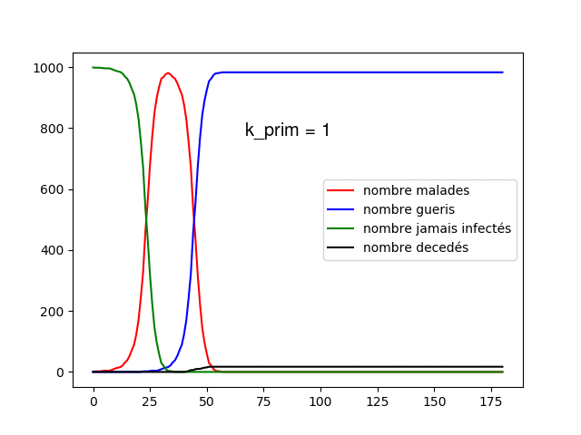
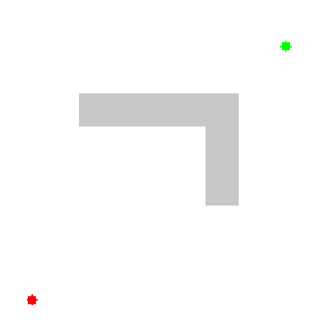
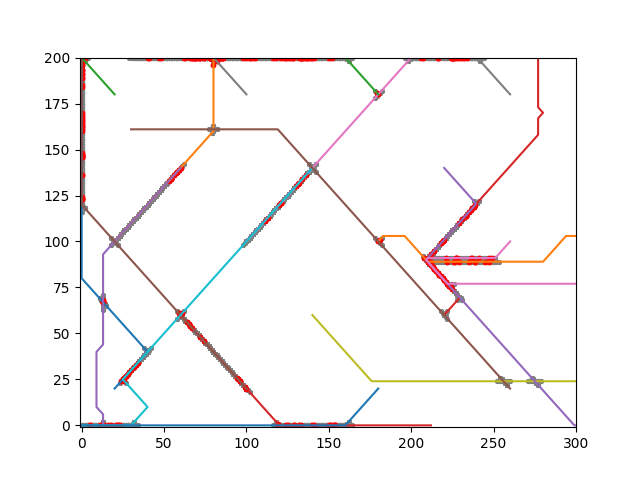
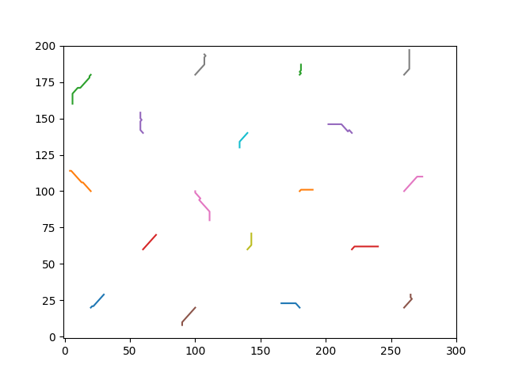

Le but de ce devoir maison est d'utiliser l'algorithmique des graphes pour
modéliser une version simpliste de la propagation du Covid-19. Le devoir se
décompose en 3 parties d'implémentation, tout d'abord nous mettons en place les
différentes paramètres (mortalité, durée de maladie) et les différents graphes. Vient ensuite le rajout de
paramètres simples comme des tests sur la population etc. Finalement nous avons
tenté de rajouter des facteurs plus réalistes et nous nous sommes un peu écartés du sujet pour proposer des compléments sur la propagation d'une épidémie et pour manipuler les notions de l'algorithmique des graphes.

## <i class="fas fa-project-diagram"></i> Partie I - Implémentation d'une base (Nathan & Aurélien)
La première partie permet de définir les bases de la modélisation c'est à dire
les différents états, les différents paramètres, les règles de changement
d'état, les topologies de graphes étudiés et les différents modèles de ces
derniers. Nous reprennons précisément les définitions du sujet. <!--  La population est pour l'instant considérée comme uniforme (chaque -->
<!-- individu est sujet à la maladie de la même manière), ils peuvent être dans -->
<!-- quatre états, Sain ($$S$$), Infecté ($$M$$), Guéri et donc imunisés ($$G$$) ou -->
<!-- décédé ($$D$$). De plus chaque personne suit les règles suivantes  -->
<!-- + Si une personne saine $$X$$ fréquente une personne malade $$Y$$ alors, avec la -->
<!--   probabilité $$q$$, $$X$$ devient malade par l'intermédiaire de $$Y$$ pour une -->
<!--   durée $$r$$.  -->
<!-- + Si une personne est malade depuis $$r$$ jours alors soit elle décède avec une -->
<!--   probabilité $$p$$ soit elle devient immunisé avec une probabilité $$(1-p)$$. -->
<!-- + Une personne immunisée ou décédée ne change jamais d'état. -->
<!-- + Une personne décédée ne peut pas contaminer une personne saine. -->

<!-- Nous allons aussi définir les différents graphes de contact permettant de -->
<!-- simuler les différentes relations de chaque individu, trois graphes sont alors -->
<!-- mis en oeuvre  -->
<!-- + Un graphe circulaire, les personnes sont numérotés de 1 à $$n$$ et chaque -->
<!--   personne, numérotés $$i$$, est relié aux personnes $$(i-1)$$ et $$(i+1)$$ -->
<!--   modulo $$n$$,  -->
<!-- + Un graphe aléatoire, on tire un graphe aléatoire de taille $$n$$ de la manière -->
<!--   suivante. Chaque noeud choisit $$k$$ noeuds choisis au hasard. Cela permet de -->
<!--   représenter de manière simpliste la population, chaque individu à un nombre -->
<!--   aléatoire de contact avec les autres individus -->
<!-- + Finalement le graphe mixe, issu de l'union du graphe circulaire et du graphe -->
<!--   aléatoire -->
  
<!-- De plus nous définissons aussi 2 modèles de graphe -->
<!-- + statique (graphe de confinement de paramère $$k'$$) : une personne confinée -->
<!--   fréquence $$k' \leq k$$ personnes sélectionnées au hasard. Il n'est pas -->
<!--   autorisée à voir les autres personnes pendant le confinement. -->
<!-- + dynamique (graphe de baisse de fréquentation de paramètre $$k'$$) : chaque -->
<!--   jour, chaque personne est autorisée à voir $$k'$$ personnes qu'elle -->
<!--   sélectionne parmi ses $$k$$ contacts. Il peut donc voir des personnes -->
<!--   différentes d'un jour à l'autre -->

### Graphe circulaire 

Dans un premier temps nous allons définir la séquence de graphe $$G_i$$
permettant de réprésenter l'état du graphe $$G$$ au jour $$i$$. Peu importe le
jour, les sommets du graphe ne change pas. Ainsi dans une première partie
d'initialisation nous construisons le graphe en fonction de la topologie choisie,
dans tous les cas le graphe possède $$n$$ sommets. Ensuite vient la
construction des arêtes du graphe. Pour le graphe circulaire, cela est effectué
dans l'initialisation, en effet les individus ne sont reliés que à leurs voisins
de droite et de gauche, cela est indépendant du jour. Par construction ce graphe
est connexe. 

De plus chaque jour, nous devons appliquer les règles de changement d'état à
tous les individus, ainsi peut importe la topologie du graphe nous parcourons le
graphe, si nous tombons sur une personne malade nous appliquons à tous ses
voisins une probabilité $$q$$ de tomber malade, si l'un tombe malade nous
initialisons un compteur représentant la durée de sa maladie. Si nous tombons
sur une personne malade depuis une durée $$r$$ nous appliquons la probabilité
$$p$$ de décéder. A noter que si une personne décède la liste de ses voisins est
vidée. 

Une fois cela présenté, nous pouvons réaliser une base de l'implémentation. Nous
définissons donc une classe python `individu`. Cela nous permet de renseigner
les informations importante sur chaque individu, son état, son identificateur,
le nombre de jour depuis lequel il est malade si il est malade. Finalement dans
cette version un individu possède aussi un tableau avec l'identificateur de ses
actuels voisins.

Résumons la construction de ce modèle. Tout d'abord nous créons une population
de taille $$n$$. Cela se fait en initialisant $$n$$ individu et donc en temps
linéaire en fonction de $$n$$. Ensuite nous créons le graphe circulaire, nous
utilisons une matrice d'adjacence, nous parcourons tous les individus $$i$$ et à
chaque fois nous mettons un 1 dans la case $$(i-1)%n$$ et $$(i+1)%n$$. Dans le
même temps nous remplissons le tableau des voisins de chaque individu. La
création de ce graphe est donc réalisé en `O(n)` où $$n$$ est
le nombre d'individu. Nous devons ensuite appliquer le modèle en fonction
de $$k$$ ou $$k'$$, cette fonction à une complexité `O(n*k')` en effet il faut
pour chaque individu lui faire choisir $$k'$$ contact parmis ses $$k$$
fréquentation. Dans le graphe circulaire $$k$$ vaut toujours 2, ainsi $$k'$$
peut valoir 2 et donc cela ne change rien ou 1. A ce stade nous avons initialisé
correctement le graphe, la complexité de l'initialisation est majorée par
`O(n*m)` où $$m$$ est le nombre moyen de voisins.

Passons maintenant au détail de la propagation jour par jour. Chaque jour nous
devons parcourir tous les individu. Si nous sommes dans un modèle dynamique nous
devons actualiser les voisins. Ensuite si l'individu est malade depuis $$r$$
jour, lui appliquer une chance de mourir, si l'individu est en contact avec des
malades lui appliquer une chance de devenir malade. Finalement nous ajoutons un jour
de maladie à tous les malades. Ainsi pour calculer l'état du graphe au jour
$$i+1$$ nous avons une fonction de complexité è `O(n+m)` où $$m$$ est le nombre
moyen de voisin d'un individu.

Nous pouvons à partir de cela établir notre code final pour le graphe circulaire en modèle
statique et dynamique. Nous initialisons dans un premiers temps le graphe et la
population. Nous faisons ensuite appel à la fonction de propagation jour par
jour le nombre de jours que nous voulons (par défaut 180), nous avons ajouté
certainnes fonctionnalités nous permettant de récupèrer chaque jour une image du
graphe et le nombre de malade, sain, remis ou décédés. *In fine* notre
algortihme principal à une complexité de `O(nbr jours * n * m)`.

Nous pouvons commencer, comme le sujet nous y invite, à simuler la propagation
dans une graphe circulaire, tout d'abord dans le modèle statique et dynamique
avec des populations de 50 et 10000 individus en prenant comme paramètres
$$r=14, p=0.01,q=0.02, k=50$$ dans cette topologie la variation de $$k'$$
influe peu sur les résultats nous prenons $$k'=2$$.
Voici quelques animations permettant de visualiser la propagation dans les
différents graphes au fur et à mesure des jours.

{:class="image about right"}
{:class="image about right"}

Nous pouvons tout d'abord observer la propagation de la maladie sur le graphe circulaire, cela est conforme à nos attentes, la maladie se propage de voisin en voisin et au bout de 14 jours chaque malade devient soit guéri soit mort. Etant donné que nous avons une chance de $$2\%$$ de mourir nous avons aucun mort car nous avons une population restreinte uniquement de 50 individus. 

Nous avons en parallèle tracé l'évolution des quatre groupes (malades, guéris, jamais infectés, décédés) sur une population de 10 000 individus, nous voyons que à cause de la faible propagation du virus la maladie ne c'est pas diffusée dans la population. Cependant il apparait clairement que les résultats sont peu satisfaisant,
en effet le graphe circulaire est relativement simpliste et ne représente que
très peu les connexions humaines. Nous devons alors parfaire notre modèle.

### Graphe Aléatoire 
Nous nous tournons donc vers la deuxième topologie proposée, le graphe
aléatoire. Celui ci relie les sommets de manière aléatoire (il est à noter qu'il
n'est pas forcément connexe). Pour gérer plus facilement le modèle statique et
dynamique nous remplissons dans l'initialisation le tableau des voisins par
$$k$$ voisin choisis de manière aléatoire, si nous sommes dans un modèle
statique nous sélectionnons aléatoirement pour chaque individu dans
l'initialisation $$k'$$ voisins parmi ses $$k$$ voisins. En revanche si nous
sommes dans un modèle dynamique, à chaque jour nous devons sélectionner
aléatoirement $$k'$$ voisins parmis ses $$k$$ contacts autorisés. Grâce à notre
implémentation basé sur un tableau contenant les $$k$$ contacts possibles et un
tableau contenant ses $$k'$$ voisins pour le jour $$i$$ la complexité de
l'initialisation et de la boucle principale reste inchangée.

{:class="image about right"}

{:class="image about right"}

Nous pouvons alors réaliser des tests en prenant les mêmes paramètres que
précédemment avec une population de 100 et en fixant $$k'=3$$ et 10 000 individus en faisant varier
$$k'$$ de $$1$$ à $$k=50$$. Nous utilisons à chaque fois le modèle statique et dynamique

Commençons par regarder les propagations, tout d'abord sur le statique, nous pouvons voir que nous avons un modèle plus réaliste, la maladie se propage au cours du temps dans la population de manière plus où moins aléatoire, certains meurt mais la majorité de la population reste saine (cela est du à la faible mortalité), de plus nous pouvons voir que la majorité de la population est infectée durant les 180 jours. Si l'on regarde le graphe dynamique nous avons visuellement une confirmation que chaque jour les connexions changent, la maladie se propage alors très vite mais peu de personnes meurent, cela est du à la population réduite que nous avons. Nous allons donc regarder ce qu'il se passe sur des populations de 1 000 individus et en faisant varier $$k'$$ entre 1 et 50 cela nous permet de voir l'influence de la fréquentation de chacun et de mettre en lumière l'effet de la distanciation sociale.

{:class="image about center"}

{:class="image about center"}

Nous voyons tout d'abord quelque chose, plus $$k'$$ augmente plus le pic épidémique est élevé et tôt, cela nous montre que les contacts favorisent la propagation de la maladie, lorsque $$k'$$ est très élevé, la propagation de la maladie à toute la population ne prend que quelques jours. Cela est encore plus visible sur le modèle dynamique, lorsque $$k'$$ est supérieur à 5, la maladie prend moins de 3 jours à infecter toute la population. 

Ce graphe est déjà plus réaliste et nous montre qu'une maladie non contrôler peut se propager rapidement, dans notre cas la mortalité est peu élevée, si nous avions une maladie plus létale elle aurait décimée rapidement toute la population. Sur une population de 10 000 individus et pour $$k'=25$$ nous obtenons le graphe suivant qui nous montre un pic épidémique très élevé (toute la population) et très tôt (15 ième jour)

{:class="image about center graph"}

Les résultats sont plus satisfaisant en effet nous pouvons voir une rapide
propagation de l'épidémie dans la population, rappelons que l'idée de cette
partie est de réussir à mettre en place un graphe représentant une population
ainsi que des connexions entre les individus de manière se rapprochant le plus
de la réalité possible. Faisons un point sur les deux graphes présentés. Nous
avons d'une part un graphe circulaire, représentant des individus connectés
uniquement avec leurs voisins. D'autre part nous avons un graphe aléatoire qui
simule des connexions totalement aléatoire avec les autres personnes. Nous allons présenter une dernière topologie. 

### Graphe mixte
Nous allons donc maintenant utiliser un graphe mixte, union des deux qui nous
permet de simuler une population qui est en contact avec ses voisins et un
nombre aléatoire d'individus. Ce graphe est le graphe le plus représentatif
d'une population humaine, après cette partie nous n'utiliserons que ce dernier.

La boucle principale n'a que très peu de modifications, dans l'initialisation
nous établissons un graphe à $$n$$ sommets, les arrêtes de ce derniers sont
définie telles que pour un individu $$i$$ il soit voisin de $$(i-1) \equiv n$$
et $$(i+1) \equiv n$$ et au maximum $$k'-2$$ voisins choisi aléatoirement parmi
les $$k$$ voisins (eux aussi choisis aléatoirement) qu'il a le droit de voir.
Grâce à notre implémentation des individus, nous pouvons réussir cette
initialisation en un temps $$O(n+m)$$ où $$m$$ est le nombre moyen de voisins.

Ensuite si nous regardons la propagation jour par jour, cette dernière ne change
pas des autres implémentations, si le modèle est statiques les arêtes sont
définies au dans l'initialisation et nous appliquons les règles de changements
d'états jours par jours. Si le modèle est dynamique, chaque jour nous modifions
les arêtes tels que chaque individu soit connecté à ses deux voisins et qu'il
soit connecté à au plus $$k'-2$$ voisins choisi parmi ses $$k$$ voisins
possibles. La boucle de simulation est donc en complexité $$O(nbr jour * n *
m)$$. 

{:class="image about right"}
{:class="image about right"}

Nous pouvons alors réaliser des tests en prenant $$k'=10$$ et les mêmes paramètres que précédemment.

Les résultats du graphe mixte sont très similaires aux résultats du graphe aléatoire, cependant nous notons en plus une propagation voisin par voisin, la maladie se propage toujours à une vitesse incroyable. Et toute la population est touchée. 

Nous avons donc définit une topologie de graphe et des modèles de graphe nous
permettant de simuler la propagation d'une maladie dans un population ayant des
intéractions ressemblant à des relations humaines. Nous avons actuellement une modélisation d'une propagation naturelle d'une maladie, cette maladie se propage rapidement et toute la population est rapidement touchée. Nous avons dans nos modèles peu de morts mais si nous avions 67 000 000 d'individus cela représente tout de même 670 000 personnes (70 millions de morts sur l'ensemble de la planète sans aucune mesure pour contenir et ralentir la maladie). 

##  <i class="fas fa-project-diagram"></i> Partie II - Rajout de tests simples (Sébastien & Antoine)
Nous allons maintenant implémenter des stratégies de réponse à l'épidémie que
vont adopter les individus. Cela se traduit par exemple par la mise en
confinement de la population ou le test massif de la population. Le but ici est
d'étudier l'efficacité des mesures de lutte contre l'épidémie. Nous serons donc
particulièrement attentif à la taille du pic épidémique et le nombre de mort
total. 

Remarquons que la première partie fera office d'exemple du déroulement "normal"
de l'épidémie sans tests ni confinement obligatoire. 

Cette partie va parler de tests sur la population. Cependant les tests pendant
une épidémie ne sont pas magiques, en effet les tests ne détectent pas avec 100%
de chance un individu malade et dans le même temps ils peuvent détecter un
individu positif alors qu'il n'est pas malade (faux positif). L'évocation de
tests dans ce rapport ne peut aller sans l'évocation du paradoxe de Simpson. Ce
dernier stipule que lors d'un test statistique dans certainnes conditions les
résultats du tests s'inversent et nous induisent donc en erreur. 

![arbre] Lorsque nous effectuons un test lors d'une épidémie le paradoxe de
Simpson est très facile à montrer. Prenons les conditions du sujet, la maladie
touche $$1\%$$ de la population, si un individu est malade, le test est positif
avec $$70\%$$ de chance. Finalement nous devons ajouter la probabilité de faux
positifs, à l'heure actuelle plusieurs
[sources](https://la1ere.francetvinfo.fr/nouvellecaledonie/tests-covid-19-un-faux-positif-et-un-faux-negatif-confirmes-par-le-cht-819510.html)
nous indiquent qu'avec les tests actuelles une personne non malade est détectée
positive avec $$10\%$$ de chance. L'arbre ci contre résume la situation où $$M$$
indique que l'individu est malade et $$T$$ indique que le test est positif. Si
nous prenons un échantillon de 10 000 individus, nous aurons alors 70 individus
malades et testé positifs, 30 malades et testé négatifs, 990 non malades testés
positifs et 8910 non malades. Le paradoxe de Simpson est mis en lumière, le
nombre de malade selon le test est supérieur au nombre de malade réel, il y a
même plus de gens non malades qui sont testé positifs que de malades qui sont
testés positifs. L'utilisation des tests est donc délicat, se faisant nous
allons confiner une partie de la population qui en réalité n'est pas malade
(dans notre cas $$9.9\%$$ de la population) et *a contrario* ne pas confiner une
partie de la population qui est vraiment malade (dans notre cas $$0.03\%$$). 

[arbre]:arbre.png
{:class="image about right"}

### Réaction sur les proches des défunts
Nous allons tout d'abord étudier des réactions de confinement et de tests suite
au décès d'une personne de son entourage. Tout d'abord nous allons mettre en
place la stratégie suivante : si une personne meurt de l'épidémie, alors toutes
les personnes l'ayant contacté dans les $$r'\leq r$$ jours est placé en
confinement (faible ou fort). Pour coller à la réalité nous prenons toujours
$$r'=r$$ car lors d'une maladie nous sommes contagieux plusieurs jours avant
d'avoir des symptômes. 

Algorithmiquement cette notion se traduit par la création du tableau de
voisins fréquentés depuis $$r$$ jours. Ce tableau est un tableau de tableau
contenant à chaque ligne les voisins que l'individu a fréquenté. Cela nous
permet de retenir les voisins de l'individu depuis $$r$$ jours. Cette opération
est coûteuse puisque chaque jour, si nous détectons un décès nous devons
parcourir le tableau d'historique des connexions et parcourir chaque ligne pour
confiner chaque individu qu'il a contacté. En somme l'ajout de cette fonction
donne une complexité à la boucle principale en temps $$O(nbr jour * n * m * r)$$
où $$r$$ est le nombre de jour que dure la maladie, $$m$$ le nombre moyen de
voisin.

Nous réalisons alors un test avec les paramètres $$k'=25$$ (pour avoir une franche différence entre le confinement fort et le normal), $$r=5, p=0.02, q=0.2$$ nous prenons une maladie avec une forte mortalité et avec une periode assez courte, le but ici est de montrer que le confinement permet de diminuer les effets d'une maladie violente et donc sera encore plus efficace sur une maladie plus classique. La topologie du graphe mixte et le modèle dynamique sont utilisées. La stratégie de confinement adoptée est le confinement fort. 

{:class="image about center"}

Nous pouvons remarquer que à contrario des résultats que nous pouvions obtenir avec le graphe mixte dynamique dans la première partie, la totalite de la population n'est pas infectée et que le pic épidémique est relativement plus faible. Nous pouvons donc voir que le confinement autour des défunts permet de conserver une partie de la population saine tout au long de la maladie et de diminuer le pic épidémique. Rappelons de plus que la maladie était très violente et foudroyante, cela nous montre d'autant plus que si la maladie était "normale" le confinement fort des proches des défunts serait efficace. 

GIF & ANALYSE
1. courbe k' fixé 10 000 individus graphe mixte dynamique CONFINEMENT FAIBLE

Nous allons maintenant modifier la façon de confiner l'entourage d'une personne
décédée. Lorsque quelqu'un décédé les personnes qu'il a contacté depuis $$r$$
jours sont testés. Le test fonctionne comme suit, si la personne est malade il a
$$70\%$$ de chance d'être confiné, si la personne n'est pas malade il a $$10 \%$$ de
chance d'être confiné. Cela ne change rien à la complexité de la fonction
puisque cette opération est faites en temps constante 

GIF & ANALYSE 
1. courbe k' fixé 10 000 individus graphe mixte dynamique CONFINEMENT FAIBLE
2. courbe k' fixé 10 000 individus graphe mixte dynamique CONFINEMENT FORT
2. GIF propagation 100 individus même carac

CONCLUSION SUR TESTS PROCHE DES DEFUNTS

### Tests aléatoires sur la population
Nous allons maintenant regarder une autre stratégie pour tenter de limiter le
pic épidémique et diminuer le nombre de mort. L'idée n'est plus de tester les
gens en contact avec un défunt qui correspond à une réaction spontannée. Il
s'âgit plutôt de tenter de prévenir les futurs cas en effectuant des tests
aléatoires sur la population et confiner les gens positifs. 

L'implémentation de cette technique se traduit par le fait que chaque jour nous
choissons aléatoirement $$n'$$ individu à tester (pour coler à la réalité $$n'$$
est proportionnel au nombre de malade, ce qui fait que plus il y a de malade
plus nous testons les gens), cela ne change pas la complexité de la boucle
principale toujours en `O(nbr jour * n * m)` avec $$m$$ le nombre moyen de
voisins.

Nous réalisons alors des tests avec les paramètres 

GIF & ANALYSE
1. courbe k' fixé 10 000 individus graphe mixte dynamique CONFINEMENT FORT
1. courbe k' fixé 10 000 individus graphe mixte dynamique CONFINEMENT FAIBLE
2. GIF propagation 100 individus même carac

CONCLUSION SUR TEST ALEATOIRES

### Mise en place de tests globaux
Nous avons vu l'efficacité des tests sur les proches des défunts qui sont une
réponse instantané à l'apparition de la maladie. De plus nous avons vu
l'efficacité des tests aléatoires sur la population qui permettent d'être
préventif. Nous allons maintenant immaginer une stratégie de tests où nous
réalisons à la fois des tests sur les proches des défunts et des tests
aléatoires sur la population. Cette stratégie devrait être la plus bénéfique et
la plus réaliste (même si cela dépend des pays). 

GIF & ANALYSE
 1. courbe k' fixé 10 000 individus graphe mixte dynamique CONFINEMENT FORT
1. courbe k' fixé 10 000 individus graphe mixte dynamique CONFINEMENT FAIBLE

CONCLUSION SUR LES TESTS

Nous avons pu étudier dans cette partie les différentes stratégies de tests de
la population pour tenter de contenir la contamination. FINIR

##  <i class="fas fa-project-diagram"></i> Partie III - Outils et amélioration
Nous allons maintenant discuter d'outils que nous avons rajoutés dans ce projet
pour compléter notre travail ou rajouter de la manipulation d'algorithmique des
graphes. 

### Visualisation à partir d'équations différentielles
#### Sébastien (Théorie & Rapport), Antoine (Implémentation dans Géogébra)
Cette partie présente un autre mode de réprésentation de la propagation de la
maladie. La représentation se fera par équation différentielles en s'inspirant
du travail de [David
Louapre](https://sciencetonnante.wordpress.com/2020/03/12/epidemie-nuage-radioactif-et-distanciation-sociale/),
*in fine* le but de cette section est de reproduire l'animation [disponible
ici](https://sciencetonnante-epidemie.netlify.app/) en utilisant le modèle SIR.
Cette section ne présente pas un travail uniquement personnel puisqu'il
s'inspire des pages précedemment mentionnées. L'idée est de présenter une
représentation qui a intéressé les membres du groupe et sur laquelle nous avons
réalisé un travail de recherche, l'implémentation réalisée avec Géogébra est de
notre oeuvre.

Le modèle $$SIR$$ est un modèle simpliste modélisant la propagation d'un agent
infectieux. Le $$S$$ désigne les individus sains, le $$I$$ désigne les individus
infectés et le $$R$$ ceux qui sont guéris. Les différents effectifs sont
exprimés en pourcentage de la population ce qui nous permet de nous détacher du
nombre d'individus. L'effectif de chacun de ces populations est évidemment
variable dans le temps, modélisable de ce par une fonction de la variable
indépendante $$t$$, le temps : $$S(t),I(t)$$ et $$R(t)$$. Si au cours de la
propagation de l'épidémie, l'effectif $$P$$ de la population peut être considéré
constant, on écrit 

$$S(t)+I(t)+R(t)=P$$ 

L'épidémie se propage par les contacts entre les individus infectés et les
individus sains. Le nombre de ces contacts est proportionnel à $$S$$ et à $$I$$.
Les malades guérissent en moyenne au bout d'un temps $$r$$, ils sont alors
immunisés et ne peuvent plus, ni infecter d'autres personnes, ni être
réinfectés. Il s'agit maintenant d'écrire un système d'équations différentielles
qui relier la dérivée des fonctions $$\dfrac{dS(t)}{dt}$$,$$\dfrac{dI(t)}{dt}$$
et $$\dfrac{dR(t)}{dt}$$, aux fonctions elles mêmes $$S(t),I(t)$$ et $$R(t)$$.
Les valeurs de $$S$$, $$I$$ et $$R$$ sont toujours positives sans dimension. 

La première équation est la variation des personnes infectés dans le temps, cette
variation est proportionnelles à l'effectif de la population infectée et à
l'effectif de la population saines multiplié par un coeffcient de propagation
$$q$$. Cela nous donne l'équation $$dI(t)/dt=qIS$$, nous rajoutons aussi le fait que
le malade reste en moyenne malade pendant $$r$$ jours, nous modifions l'équation
pour l'intégrer ainsi $$dI(t)/dt=qIS-I/r$$. Finalement nous devons ajouter terme
représentant la mortalité de la maladie, nous récrivons alors l'équation en
intégrant l'indice $$p$$ de mortalité : $$dI(t)/dt=qIS-I/r-pI$$. Avec
l'adjonction de ce terme, la population totale ne peux plus rester constante.
Elle diminue sous l'effet de cette mortalité, la simulation permet de le montrer facilement.

La deuxième équation est la variation des personnes saines dans le temps, cette
variation est symétrique par rapport à la variation des personnes infectés dans
le temps. L'équation est donc $$dS(t)/dt=-qIS$$.

Finalement nous plaçons l'équation du nombre de guéris en fonction du temps,
$$dR(t)/dt=I/r$$. En somme le modèle s'écrit

$$\begin{align*} \dfrac{dS(t)}{dt} &= - q I S \\ \dfrac{dI(t)}{dt} &= q I S -
\dfrac{I}{r} \\ \dfrac{dR(t)}{dt} &= \dfrac{1}{r}\end{align*}$$

Nous avons simulé le comportement des variables $$I(t), S(t)$$ et $$R(t)$$,
comme toute simulation il est nécessaire de fixer
1. La valeur des conditions initialies, c'est à dire les valeurs de $$I$$, de
   $$S$$ et de $$R$$ au temps $$t=0$$.
2. Les valeurs des paramètres, ici $$q,p,r$$.  

<iframe id="inlineFrameExample"
    title="Simulation modèle SIR"
    width="100%"
    height="400"
    src="SIR.html">
</iframe>
Si la fenêtre ne charge pas [lien vers la simulation](SIR.html) 

### Mise en lumière de l'efficacité du confinement par la modélisation simpliste des déplacements 
#### Sébastien
*Cette section présente l'implémentation d'une fonction supplémentaire dont le
rapport avec le sujet est discutable. L'idée de cette section est de nous faire
manipuler les notions d'algortihmique des graphes et l'implémentation de ces notions* 

Toujours dans le cadre du Covid-19 nous voulons montrer l'effet du confinement
en modélisant les déplacements humains et en autorisant plus ou moins de
distance maximale de déplacement. Nous regardons ensuite en fonction de la
distance autorisée le nombre de malade. Pour cela nous modélisons un monde
réduit avec 18 individus et des obstacles mis aléatoirement sur la carte. 

Ce sujet nous invite à mettre en place un moyen d'effectuer une recherche de
chemin, pour ce faire nous allons utiliser un algorithme de recherche de chemin
rapide, l'algorithme A*.

#### Présentation et principe de l'algorithme.
L'algorithme A* est un algorithme basé sur un principe très simple. A chaque
itération nous allons tenter de nous rapprocher de la destionation, nous allons
donc privilégier les possibilités directement plus proches de la destination, en
mettant de côté toutes les autres.

Toutes les possibilités ne permettant pas de
se rapprocher de la destination sont mises de côté mais pas supprimées. Elles
sont simplement mises dans une liste de possibilités à explorer si jamais la
solution explorée actuellement s'avère mauvaise. En effet, nous ne pouvons pas
savvoir à l'avance si un chemin va aboutir ou sera le plus court. Il suffit que
ce chemin amène à une impasse pour que cette solution devienne inexploitable.

L'algorithme va donc d'abord se diriger vers les chemins les plus directs. Et si
ces chemins n'aboutissent pas ou bien s'avèrent mauvais par la suite, il
examinera les solutions mises de côté. C'est ce retour en arrière pour examiner
les solutions mises de côté qui nous garantit que l'algorithme nous trouvera
toujours une solution.

Nous pouvons donc lui donner un terrain avec autant d'obstacles que nous
voulons, si il y a une solution l'A* la trouvera. Un résumé du fonctionnement de l'algorithme est disponible sur le graphe ci dessous.

{:class="image about center"}

Une description des itérations de l'algorithme est disponible [ici](https://www.createursdemondes.fr/2015/03/pathfinding-algorithmes-en-a/)

La complexité de cet algorithme dépend de l'implémentation des structures de données des listes et le temps que nous mettons à acceder à ces éléments. Nous utilisons un tas comme implémentation, la complexité de l'A* est donc `O(n+m log(n))` avec $$n$$ le nombre de sommets et $$m$$ le nombre d'arềtes moyenne d'un sommet.

Nous avons alors implémenté notre Astar en python, ce dernier se base sur un
Astar développé en c++ réalisé par Sébastien dans le cadre de Eirbot (les codes
des deux implémentations sont disponibles dans les sources). L'idée est que
chaque individu choisisse aléatoirement un point auquel il va aller un jour puis
revient chez lui. Si il croise quelqu'un dans un rayon autour de lui il a une
chance de tomber malade et initie un compteur de jour, si il est malade depuis
$$r$$ jour il a une chance de mourir. Nous lançons deux simulations, pour des
soucis de lisibilité nous ne marquons pas les obstacles et nous ne faisons
qu'une itération du programme pour comprendre le processus, les itérations
suivantes ramènent à des résultats que nous avons déjà présenté.

Tout d'abord si les individus n'ont aucune limite sur leurs déplacement. Les
contacts sont représentés par une marque grise et les marques rouge
correspondent à une infection. 

{:class="image about center"}

Nous voyons que nous obtenons beaucoup de contact et donc d'infections, ainsi
laisser les gens évoluer librement n'est pas une idée concevable. Nous avons
donc relancé la simulation en forçant les individus à rester dans un rayon
autour de chez eux. Nous obtenons alors les résultats suivants 

{:class="image about center"}

Nous obtenons alors un résultat radicalement différent, comme les gens ne sont
en contact avec personne d'autre nous n'avons aucune infection. Cela démontre
l'importance du confinement. Bien-sur le modèle est simpliste puisqu'il est
impossible de rester chez soi pendant une durée illimitée, pour rappel ici le
but était de nous faire manipuler des notions d'algorithmique des graphes. 

##  <i class="fas fa-project-diagram"></i> Conclusion
Nous avons donc réalisée une modélisation simpliste de la propagation du
covid-19. Cela nous a permis de nous intéresser aux différents graphes de
connexion ce qui nous a permis de trouver celui le plus représentatif. Ensuite
nous avons étudié comment contenir la maladie en mettant en place du
confinement, des tests etc. Finalement nous avons réalisé une ouverture en
regardant 2 modèles différents le modèle SIR et l'utilisation de l'A* pour faire
notre modèle.

 
 

 

	
